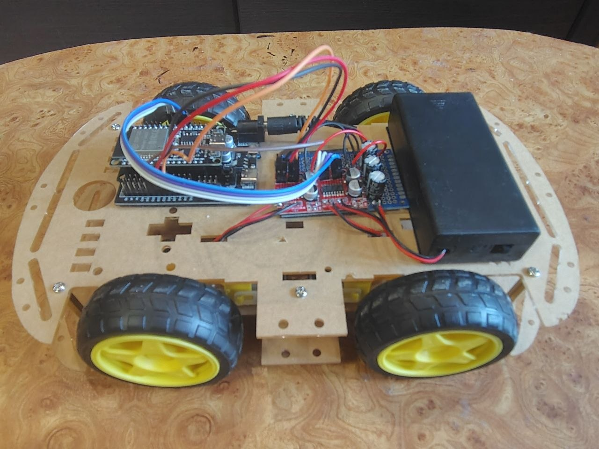
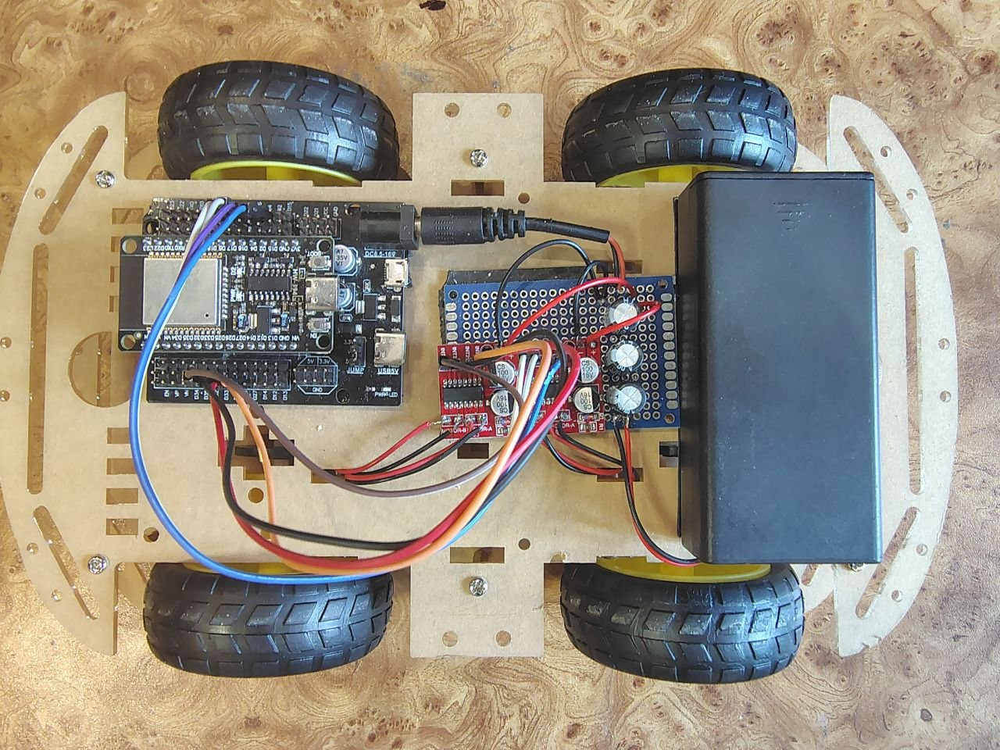
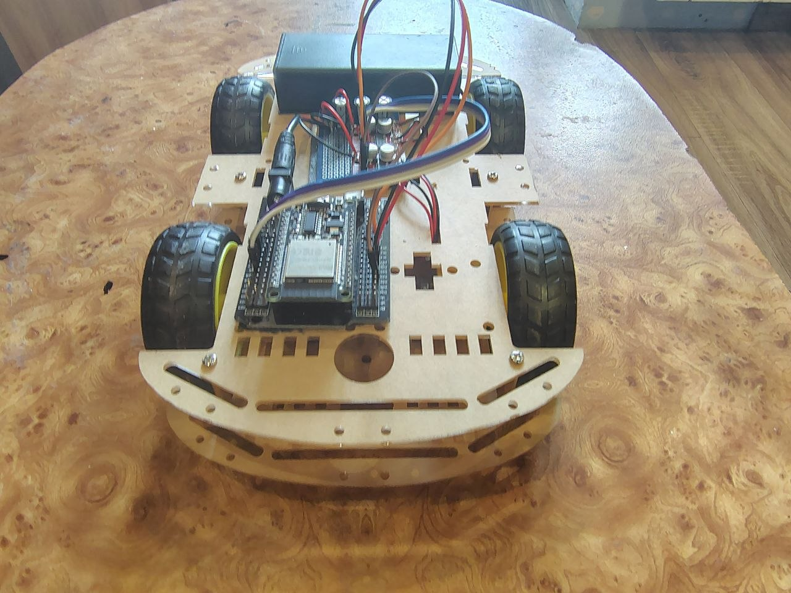
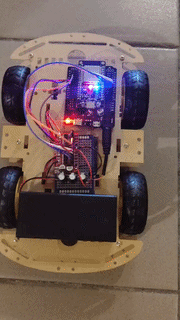
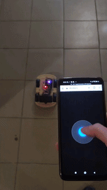
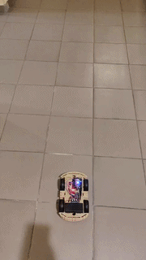

# 4WD ESP32 Robotics Platform (FreeRTOS & ICR Kinematics)

<table border="0">
  <tr>
    <td width="33%" align="center">
      
    </td>
    <td width="33%" align="center">
      
    </td>
    <td width="33%" align="center">
      
    </td>
  </tr>
</table>

An embedded 4-wheel drive robotic chassis engineered with ESP32, featuring deterministic FreeRTOS task handling, high-power EMI filtering, and custom open-loop kinematics based on the Instantaneous Center of Rotation (ICR).

## Technical Highlights

- **Multi-Core Determinism:** Core 0 isolates asynchronous Wi-Fi/WebSocket stack handling; Core 1 runs a deterministic 50 Hz (`20 ms`) motor control loop.
    
- **ICR Steering Kinematics:** Independent 4-channel PWM mapping models the Instantaneous Center of Rotation to reduce tire scrubbing on high-friction surfaces.
    
- **Software Slew Rate Limiting:** Non-blocking PWM ramping eliminates battery voltage sags (brownouts) and mechanical gearbox shocks.
    
- **Power & EMI Resilience:** Hardware decoupling using bulk electrolytic capacitors and $100\text{ nF}$ ceramic motor filters to absorb back-EMF and noise.
    
- **Fail-Safe Watchdog:** Integrated watchdog timer triggers an immediate emergency shutdown if WebSocket connectivity drops for over $500\text{ ms}$.
    

## Electrical Engineering & Hardware Setup

```
[ 2x 18650 Li-ion (7.4V - 8.4V) ] 
               │
               ├──────► [ DC Jack 5.5mm ] ──► [ ESP32 Expansion Shield ] ──► [ ESP32 DevKit ]
               │
               ├──────► [ Heavy-Duty Power Bus Bars (Solder Bridges) ]
               │                 │
               │                 ├──► [ 3x 100uF Bulk Electrolytic Capacitors ]
               │                 │
               │                 └──► [ 2x MX1508 Dual H-Bridge Drivers ]
               │                                   │
               └───────────────────────────────────┼──► [ 4x DC Motors w/ 104 Ceramic Filters ]
                                                   │
                                     (Shared GND Rail)
```

- **Power Delivery:** Powered by two 18650 Li-ion cells ($7.4\text{V} - 8.4\text{V}$) connected via a spliced $5.5\text{ mm}$ DC Jack.
    
- **Transient & EMI Suppression:**
    
    - **Bulk Decoupling:** Three $100\text{ }\mu\text{F}$ electrolytic capacitors ($300\text{ }\mu\text{F}$ total) cushion voltage drops during peak motor startup currents.
        
    - **Motor Noise Filtering:** $100\text{ nF}$ (code `104`) ceramic capacitors soldered across each motor's terminals suppress brush arcing and high-frequency noise.
        
    - **Low-Resistance Power Rails:** High-current paths were reinforced on the perfboard using thick solder bridges.
        
- **Motor Drivers:** Two MX1508 dual H-bridge modules driving 4 independent channels.
    

## Software Architecture & FreeRTOS Execution

```
[ HTML5 Touch Joystick ] 
         │ (WebSocket Frames "x,y")
         ▼
[ Core 0: AsyncWebSocket Server ]
         │
         │ (xQueueSend - Thread-Safe)
         ▼
[ FreeRTOS Queue (CommandMsg) ]
         │
         │ (xQueueReceive @ 50 Hz)
         ▼
[ Core 1: Chassis Task ] ──► [ ICR Kinematics ] ──► [ PWM Ramp ] ──► [ MX1508 Drivers ]
```

- **Core Isolation:** Asynchronous network I/O is isolated on **Core 0**, preventing Wi-Fi stack interrupts from stalling motor PWM timing on **Core 1**.
    
- **Thread-Safe IPC:** Real-time $(x, y)$ coordinate frames pass between network handlers and the motor loop via an `xQueueHandle` queue.
    
- **PWM Acceleration Ramping:** Smooths speed transitions to prevent inductive spikes and mechanical wear:
    
    - `stepLinear = 8` (Straight-line acceleration)
        
    - `stepTurn = 2` (Controlled cornering)
        

## Kinematics & Instantaneous Center of Rotation (ICR)

<table border="0" width="60%" align="center">
  <tr>
    <td width="33%" align="center" valign="top">
      
    </td>
    <td width="33%" align="center" valign="top">
      
    </td>
    <td width="33%" align="center" valign="top">
      
    </td>
  </tr>
</table>

In a 4WD skid-steer platform without active wheel steering, traditional tank-turn differential drive causes significant tire scrubbing, mechanical resistance, and current spikes during turns. 

To achieve smooth cornering, the motion control algorithm dynamically models the **Instantaneous Center of Rotation (ICR)** — the theoretical pivot point on the floor plane around which all four wheels describe concentric trajectories.

```
                   [LF]-----------[RF]
                    |      |       |
                    |     (C)      |  <-- Chassis Center
                    |      |       |
                   [LB]-----------[RB] ------------- * ICR (Instantaneous Center)
                    |<-- R_LB ---->|<--- R_RB ----->|
```

### Theoretical Principle & Speed Scaling

According to rigid body kinematics, the linear velocity $V_i$ of each wheel must be directly proportional to its geometric radius $R_i$ from the ICR:

$$V_i = \omega \cdot R_i$$

Where $\omega$ is the chassis angular velocity around the ICR[cite: 1].

To approximate this open-loop geometry, target wheel PWM speeds are calculated by scaling the base directional vectors ($V_{\text{outer}} = Y + |X|$, $V_{\text{inner}} = Y - |X|$) using radius-proportional factors $K_{\text{icr}}$:

$$V_{\text{wheel}} = K_{\text{icr}} \cdot V_{\text{base}}$$

### Speed Distribution Coefficients

| Wheel Channel | Position relative to ICR | Right Turn ($X > 0$) | Left Turn ($X < 0$) |
| :--- | :--- | :--- | :--- |
| **Left Front (LF)** | Outer Front (Max Radius $R_{\text{LF}}$) | $1.00 \cdot (Y + X)$ | $0.60 \cdot (Y + X)$ |
| **Left Back (LB)** | Outer Rear ($R_{\text{LB}}$) | $0.85 \cdot (Y + X)$ | $0.30 \cdot (Y + X)$ |
| **Right Front (RF)** | Inner Front ($R_{\text{RF}}$) | $0.60 \cdot (Y - X)$ | $1.00 \cdot (Y - X)$ |
| **Right Back (RB)** | Inner Rear (Closest to ICR $R_{\text{RB}}$) | $0.30 \cdot (Y - X)$ | $0.85 \cdot (Y - X)$ |

```cpp
// Right turn execution (X > 0): ICR shifts to the right of the rear axis
if (x > 0) {
    int outerBase = y + x;
    int innerBase = y - x;

    targetLF = outerBase;                             // Max radius (1.00)
    targetLB = static_cast<int>(outerBase * 0.85f);  // Outer rear (0.85)
    targetRF = static_cast<int>(innerBase * 0.60f);  // Inner front (0.60)
    targetRB = static_cast<int>(innerBase * 0.30f);  // Min radius / Pivot (0.30)
}
```

Engineering Benefits
- Reduced Tire Scrubbing: Eliminates mechanical friction during turns, protecting 3D-printed/plastic gearboxes.
- Power Drop Mitigation: Prevents motor stall currents and protects the shared battery rail from brownout resets.
- Smooth Trajectory Control: Enables fluid transitions from wide arcs at low $X$ inputs to tight pivot turns as $X \to 100\%$

## Pinout Configuration

| **Motor Channel**    | **Direction / PWM Pins** | **ESP32 GPIO**    |
| -------------------- | ------------------------ | ----------------- |
| **Left Back (LB)**   | `Bwd` / `Fwd`            | GPIO 4 / GPIO 16  |
| **Right Back (RB)**  | `Bwd` / `Fwd`            | GPIO 17 / GPIO 18 |
| **Left Front (LF)**  | `Bwd` / `Fwd`            | GPIO 26 / GPIO 25 |
| **Right Front (RF)** | `Bwd` / `Fwd`            | GPIO 33 / GPIO 32 |

## Key Lessons Learned & Future Improvements

### Engineering Insights

- **Hardware Resilience:** Diagnosed and mitigated brownout resets using bulk decoupling capacitors and soft-start PWM algorithms.
    
- **Noise Suppression:** Resolved micro-controller glitches caused by motor brush spark noise by soldering $100\text{ nF}$ ceramic filtering capacitors.
    
- **RTOS Task Scheduling:** Implemented deterministic task execution using FreeRTOS primitives (`TaskPinnedToCore`, Queues).
    

### Planned Upgrades
    
- Upgrade from open-loop PWM control to closed-loop velocity PID using wheel encoders.
    
- Integrate an MPU6050 IMU for active heading stabilization.
